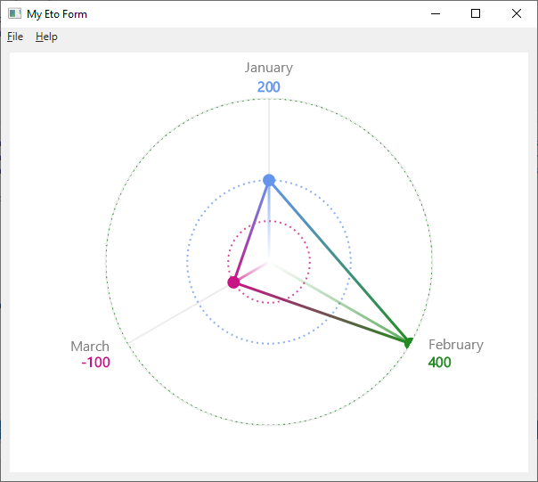

# Eto.Microcharts

[](https://github.com/rafntor/Eto.Microcharts/actions/workflows/build.yml)
[](https://sonarcloud.io/summary/new_code?id=rafntor_Eto.Microcharts)
[](https://www.nuget.org/packages/Eto.Microcharts/)
[](LICENSE)

Provides an [**Eto.Forms**](https://github.com/picoe/Eto) view control for [**Microcharts**](https://github.com/microcharts-dotnet/Microcharts).

Demo applications : https://nightly.link/rafntor/Eto.Microcharts/workflows/build/master

## Quickstart

Use NuGet to install [`Eto.Microcharts`](https://www.nuget.org/packages/Eto.Microcharts/) then create a `Eto.Microcharts.ChartView` like in the following example:
```cs
var entries = new Microcharts.ChartEntry[]
   {
      new Microcharts.ChartEntry(200) { Label = "January", ValueLabel = "200", Color = SkiaSharp.SKColors.CornflowerBlue },
      new Microcharts.ChartEntry(400) { Label = "February", ValueLabel = "400", Color = SkiaSharp.SKColors.ForestGreen },
      new Microcharts.ChartEntry(-100) { Label = "March", ValueLabel = "-100", Color = SkiaSharp.SKColors.MediumVioletRed }
   };
this.Content = new Eto.Microcharts.ChartView() { Chart = new Microcharts.RadarChart { Entries = entries, AnimationProgress = 100 } };
```

  
